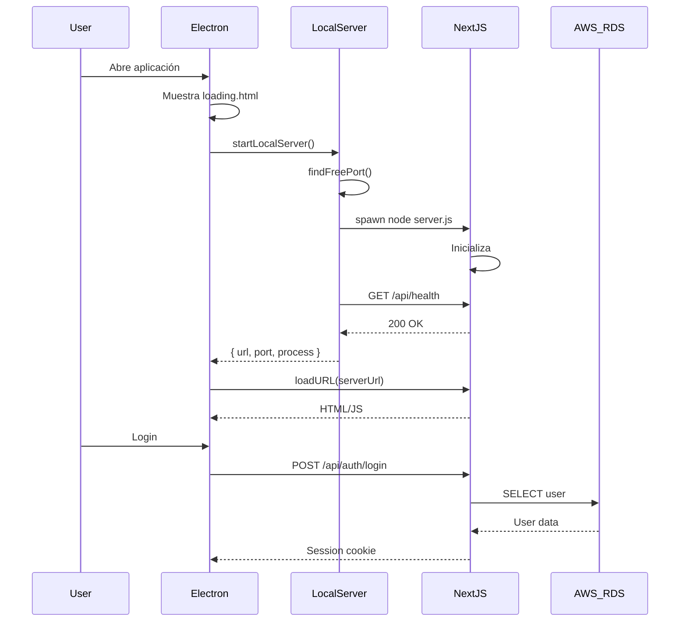

# MarketPOS Desktop Runtime

## Arquitectura de Runtime

```
┌─────────────────────────────────────────────────────────┐
│                     Electron Shell                       │
│  ┌───────────────────────────────────────────────────┐  │
│  │                  Main Process                      │  │
│  │  • Gestión de ventanas                            │  │
│  │  • Seguridad (CSP, sandbox)                       │  │
│  │  • Lifecycle del servidor local                   │  │
│  └────────────────────┬──────────────────────────────┘  │
│                       │                                  │
│  ┌────────────────────▼──────────────────────────────┐  │
│  │              Local Server Manager                  │  │
│  │  • Puerto dinámico (43110-43200)                  │  │
│  │  • Health check (/api/health)                     │  │
│  │  • Graceful shutdown                              │  │
│  └────────────────────┬──────────────────────────────┘  │
│                       │                                  │
│  ┌────────────────────▼──────────────────────────────┐  │
│  │           Next.js Standalone Server               │  │
│  │  • UI React (renderer process)                    │  │
│  │  • API Routes (/api/*)                            │  │
│  │  • Prisma → AWS RDS (por ahora)                   │  │
│  └───────────────────────────────────────────────────┘  │
└─────────────────────────────────────────────────────────┘
```

## Modos de Operación

### Desarrollo (`npm run dev` en /desktop)

1. Usuario inicia servidor web manualmente: `npm run dev` en raíz
2. Electron conecta a `http://localhost:3000`
3. Hot reload funciona normalmente

```bash
# Terminal 1 (raíz del proyecto)
npm run dev

# Terminal 2 (carpeta desktop)
cd desktop
npm run dev
```

### Producción (Instalador)

1. Electron inicia
2. Main process lanza Next.js standalone en puerto libre
3. Espera health check OK
4. Carga la URL del servidor local

```
[App] Starting MarketPOS Desktop...
[App] Mode: Production
[LocalServer] Starting Next.js standalone server...
[LocalServer] Using port: 43110
[LocalServer] Server path: C:\...\resources\server\server.js
[LocalServer] READY http://127.0.0.1:43110
```

## Build para Desktop

### 1. Build Next.js con output standalone

```bash
# En raíz del proyecto
DESKTOP_BUILD=1 npm run build
```

Esto genera `.next/standalone/` con servidor autocontenido.

### 2. Build instalador Electron

```bash
cd desktop
npm run build
```

Genera `dist-electron/MarketPOS-Setup-X.X.X.exe`

## Puerto Dinámico

El servidor usa un puerto en el rango **43110-43200**:

- Evita conflictos con otros servicios
- Se selecciona automáticamente el primer puerto libre
- El puerto se comunica al proceso principal vía `serverUrl`

## Health Check

Antes de mostrar la UI, el sistema verifica:

```http
GET http://127.0.0.1:{port}/api/health
```

- Timeout: 30 segundos
- Intervalo: 500ms
- Requiere respuesta 200 OK

Si falla, muestra pantalla de error con opción de reintentar.

## Graceful Shutdown

Al cerrar la ventana:

1. `window-all-closed` event
2. `localServer.kill()` envía SIGTERM
3. Espera 5 segundos
4. Si no termina, envía SIGKILL
5. `app.quit()`

## Variables de Entorno

El servidor carga `.env` desde `resources/.env`:

| Variable | Descripción |
|----------|-------------|
| `DATABASE_URL` | Conexión a PostgreSQL (AWS RDS) |
| `SESSION_SECRET` | Secreto para iron-session |
| `CLOUDINARY_*` | Configuración de imágenes |
| `DESKTOP_MODE` | `true` (inyectado automático) |

## Flujo Completo



## Troubleshooting

### "Server did not start within 30000ms"

- Verificar que el build standalone existe
- Revisar logs de Next.js en consola
- Asegurar que `.env` tiene `DATABASE_URL`

### "Server not found at: ..."

```bash
# Regenerar build standalone
DESKTOP_BUILD=1 npm run build
```

### Puerto en uso

El sistema automáticamente busca el siguiente puerto libre.
Si todos los puertos están ocupados (43110-43200), verificar:

```powershell
netstat -ano | findstr "4311"
```

## Seguridad

| Característica | Estado |
|----------------|--------|
| contextIsolation | ✅ Habilitado |
| nodeIntegration | ✅ Deshabilitado |
| sandbox | ✅ Habilitado |
| CSP | ✅ Configurado |
| webSecurity | ✅ Habilitado |
| Navegación externa | ✅ Bloqueada |

## Próximos Módulos

- **D3**: PostgreSQL embebido (modo offline)
- **D4**: Sincronización cloud ↔ local
- **D5**: Auto-updates
